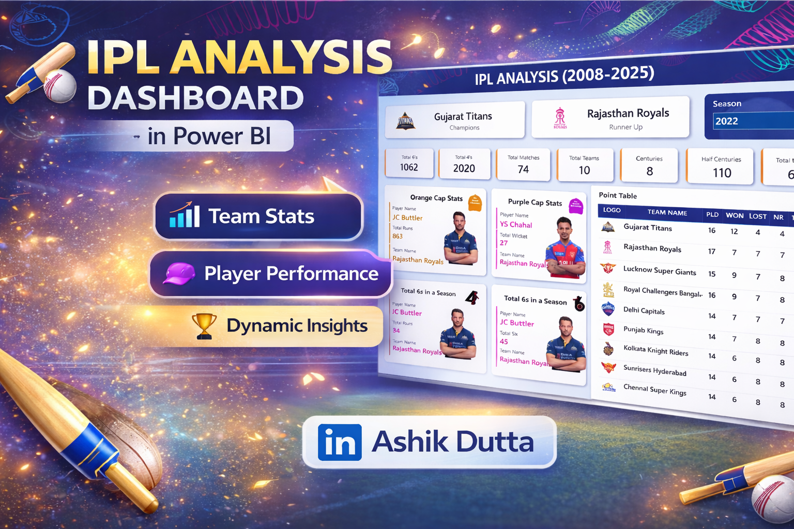

# 🏏 IPL Analysis Dashboard (2008–2025)

## 📊 Project Overview
This project is an interactive Power BI dashboard that provides insights into IPL seasons, teams, and player performances.

## 🔥 Key Features
- Dynamic Season Filter
- Orange Cap & Purple Cap Analysis
- Team Performance Metrics
- Player Stats (Most 4s & 6s)
- Points Table Visualization

## 🛠 Tools Used
- Microsoft Power BI
- DAX
- Data Visualization

## 🌐 Live Dashboard
(https://www.linkedin.com/posts/ashik-dutta-a613a3219_powerbi-dataanalytics-dashboard-activity-7452084061902118912-134p?utm_source=share&utm_medium=member_desktop&rcm=ACoAADcNeCkBcYxMRZzZl3Z_vkZ22mwyy2k36MY)

## 👨‍💻 Author
Ashik Dutta
